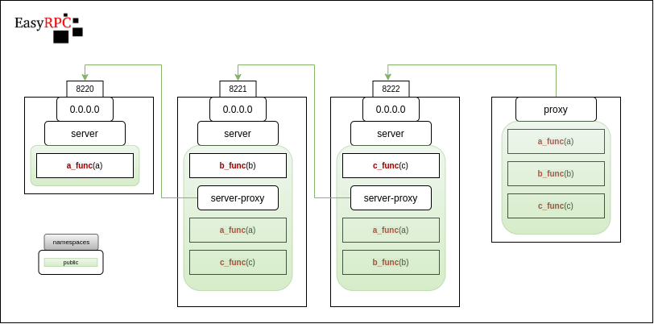
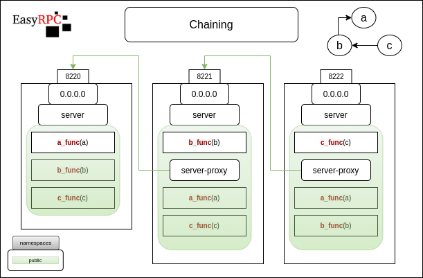
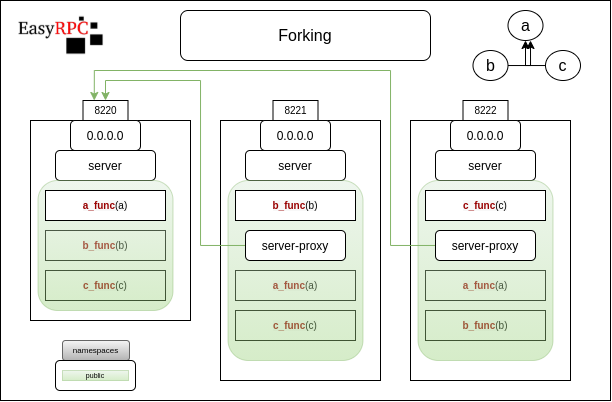

## Clustering

EasyRpcServer namepaces can be grouped together with other EasyRpcServer instances, to form "clusters"

### Cluster Features:
- Dynamically Share new / existing functions amongst cluster members  
- Proxy and Reverse proxy functions automatically propogate changes up / downstream every 15 seconds
- Access to all functions anywhere in a chain

### Cluster Example



#### Server A
```python
# Server A - port 8220
server = FastAPI()
server_a = EasyRpcServer(server, '/ws/server_a', server_secret='abcd1234')

@server_a.origin(namespace='public')
def a_func(a):
    return {'a': a}
```

#### Server B
```python

# Server B - port 8221
server = FastAPI()
server_b = EasyRpcServer(
    server, 
    '/ws/server_b', 
    server_secret='abcd1234'
)

@server_b.origin(namespace='public')
def b_func(b):
    return {'b': b}

@server.on_event('startup)
async def setup():
    await server_b.create_server_proxy(
        0.0.0.0, 
        8220, 
        '/ws/server_a', 
        server_secret='abcd1234', 
        namespace='public'
    )
```
#### Server C

```python

# Server C - port 8222
server = FastAPI()
server_c = EasyRpcServer(
    server, 
    '/ws/server_c', 
    server_secret='abcd1234'
)

@server_c.origin(namespace='public')
def c_func(c):
    return {'c': c}

@server.on_event('startup)
async def setup():
    await server_c.create_server_proxy(
        '0.0.0.0', 
        8221, 
        '/ws/server_b', 
        server_secret='abcd1234', 
        namespace='public'
    )
```
!!! TIP
    Servers A, B or C can now be accessed via a Proxy to use a_func, b_func, or c_func

####  Proxy
```python
#client.py
import asyncio
from easyrpc.proxy import EasyRpcProxy

async def main():
    public = await EasyRpcProxy.create(
        '0.0.0.0', 
        8221, 
        '/ws/server_b', 
        server_secret='abcd1234',
        namespace='public'
    )

    await public['a_func']('a')
    await public['b_func']('b')
    await public['c_func']('c')
```

### Cluster Constraints:
!!! TIP 
    An EasyRpcServer instance may connect up to 1 other EasyRpcServer instance by via a server_proxy per namespace. 
    
    The target instance should not be a direct child of the instance connecting(i.e loop) 
    
    #### OK
    A->B->C->A

    #### WRONG 
    A -> B -> A

!!! TIP 
    An EasyRpcServer can recive n connections from other EasyRpcServer server proxies into a single namespace. 


### Clustering Patterns

#### Chaining



```bash
A(pub) <-- B(pub) <-- C(pub) <-- D(pub)
```

#### Forking



```bash
A(pub) <-- B(pub)
A(pub) <-- C(pub)
A(pub) <-- D(pub)
```

#### Ring


```python
A(left) <-- B(left) <-- C(left)
A(right) --> C(right) --> B(right)
```
    
##### Creating a ring
```python
A.create_namespace_group('ring', 'left', 'right')
B.create_namespace_group('ring', 'left', 'right')
C.create_namespace_group('ring', 'left', 'right')
```

#### Other Considerations
- Each cluster patterns allow for further forking / chains off the initial nodes of the cluster within the constraints mentioned above.

- Each namespace-node within the cluster will have access to every other node(namespace) registered functions. 
<br>

- The path a node takes to reach a function is relative to where the node registered. 
!!! Access

     A(pub) <-- B(pub) <-- C(pub) <-- D(pub)

!!! Note "D can access functions on A"
    D -> C <br>
    C -> B <br>
    B -> A <br>

##### Breaks in a Chain
!!! Warning "Connection Interuption"

    D -> C <br>
    C # BREAK # B <br>
    B -> A <br>

- C dectects connection is missing, the next proxy probes will remove functions specfic to B & A within the namespace, then propgating the update to D.

- B dectects connection is missing, the next proxy probes will remove functions specfic to C & D within the namespace, then propgating update A.

!!! TIP 
    Namespace Groups, discussed next, can help to address these connection interuption concerns. 

### Namespace Groups 
A EasyRpcServer may group two or more namespaces into a single namespace group, providing a single namespace for accessing functions in the group member namespaces. 

#### Features / Considerations:
- Functions registered to namespace groups automatically register within the member namespaces
- Namespaces do not allow for duplicate functions, but namespace groups may contain namespaces with same-name functions 
- Namespaces within namespace groups may consist of local / proxy functions
- Function calls from a namespace group use the first function with the matching name, a duplicates amoungst members are used if the connection to the first function namespace is lost / un-registered.
- Namespace Group appears like a single Namepsace. If a SERVER proxy connects, all member functions are shared to the connecting Proxy, and all discovered functions are updated in all member namespaces. 

#### Usage 
!!! TIP "Ring Pattern - Map multiple paths to same functions"

    Left  - A <- B <- C <br>
    Right - A -> C -> B <br>
    Namespace Group ('ring', 'left', 'right') <br>

##### Server A
```python
# Server A - port 8220

server = FastAPI()
server_a = EasyRpcServer(server, '/ws/server_a', server_secret='abcd1234')
server_a.create_namespace_group('ring', 'left', 'right')

@server_a.origin(namespace='ring')
def a_func(a):
    return {'a': a}

@server.on_event('startup)
async def setup():
    def delay_proxy_start():
        # sleep to allow other servers to start
        await asyncio.sleep(15)

        await server_a.create_server_proxy(
            0.0.0.0, 8222, '/ws/server_a', server_secret='abcd1234', namespace='right'
        )
    asyncio.create_task(delay_proxy_start())

```

##### Server B
```python
# Server B - port 8221
server = FastAPI()
server_b = EasyRpcServer(server, '/ws/server_b', server_secret='abcd1234')
server_b.create_namespace_group('ring', 'left', 'right')

@server_a.origin(namespace='ring')
def b_func(b):
    return {'b': b}

@server.on_event('startup)
async def setup()
    await server_b.create_server_proxy(
        0.0.0.0, 8220, '/ws/server_a', server_secret='abcd1234', namespace='left'
    )
```
##### Server C
```python
# Server C - port 8222
server = FastAPI()
server_c = EasyRpcServer(server, '/ws/server_c', server_secret='abcd1234')
server_c.create_namespace_group('ring', 'left', 'right')

@server_a.origin(namespace='ring')
def c_func(c):
    return {'c': c}

@server.on_event('startup)
async def setup()
    await server_c.create_server_proxy(
        0.0.0.0, 8221, '/ws/server_b', server_secret='abcd1234', namespace='left'
    )
```

All functions in EasyRpcServer A, B, C are registered to both left and right namespaces via ring Namespace Group.  
!!! TIP "Server A has two paths to functions on Server B & C"
    A -> C -> B <br>
    A -> B -> C <br>

!!! TIP "Server B has two paths to functions on Server A & C"
    B -> A -> C <br>
    B -> C -> A <br>

!!! TIP "Server C has two paths to functions on Server B & C"

    C -> B -> A <br>
    C -> A -> B <br>

#### Registering a method to Namespace Group

Simple Grouping and 1 Proxy Connection with single decorator

##### Server - With Namespace Group
```python
#Public  - A <- B <- C
#Private - A <- D <- E <- F
#Open - A -> G -> H
rpc_server.create_namespace_group('all', 'Public', 'Private', 'Open')
@rpc_server.origin(namespace='all')
def func(a, b, c=10):
    return [a, b, c]
```
!!! NOTE
    A standard proxy connection provides access to 1 namespace, Namespace Groups can provide two or more namespaces with the same connection.

##### Proxy - connecting to a Namespace Group
```python
    all_namespaces = await EasyRpcProxy.create(
        '0.0.0.0', 
        8220, 
        '/ws/easy', 
        server_secret='abcd1234',
        namespace='all'
    )
```